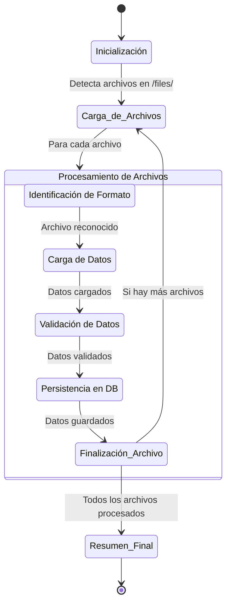

# Proyecto de Carga y Validación de datos
Este proyecto es una aplicación modular en Python diseñada para automatizar la carga ded atos desde diferentes tipos de archivos, realizar validaciones básicas y persistirlos en una base de datos realcional. La aplicación busca poner en practica la Programación Orientada a Objetos (POO), aplicando los pilares fundamentales de este paradigma.

## ✨ ¿Qué Hace el Proyecto?
La aplicación permite procesar automáticamente múltiples archivos ded datos ubicados en el directorio `files/`. Al ejecutar el script principal (`main.py`), la aplicación:
1. Identifica la extensión de cada archivo (.csv, .json, .xlsx).
2. Carga los datos utilizando lógica específica para cada formato de archivo.
3. Realiza validaciónes básicas sobre los datos cargados
4. Persiste los datos en una base de datos relacional, creando una tabla dedicada para cada archivo.
5. Informa el estado de cada operación de carga y guardado

La carga de cada archivo se realiza de forma modular, facilitando la adición de nuevos tipos de archivos o reglas de validación.

## 🚀 Ejecución
El proceso se ejecuta desde el archivo principal `main.py`, que orquesta todo el proceso. Este archivo actua com coordinador, delegando las tareas específicas (cargar, validar y guardar) a las clases especializadas.




## 🏗️ Estructura del Proyecto 

```
├── project_root/
│   ├── main.py                     # Archivo principal para la ejecucion el programa
│   ├── data/                       # Modulo para persistencia de datasets en base de datos
│   │   ├── data_saver.py           # Clase responsable de la conexión y guardado en la BD (SQLAlchemy)
│   │   ├── .envexample             # Archivo de ejemplo para variables de entorno (ej. credenciales de BD)
│   │   └── __init__.py
│   ├── domain/                     # Capa de Dominio (Logica de Validacion y Modelos de Datos)
│   │   ├── dataset.py              # Clase base abstracta para los datasets (Abstracción y Herencia) y validaciones generales
│   │   ├── dataset_csv.py          # Implementación para archivos CSV (Polimorfismo)
│   │   ├── dataset_json.py         # Implementación para archivos JSON (Polimorfismo)
│   │   ├── dataset_xlsx.py         # Implementación para archivos XLSX (Polimorfismo)
│   │   └── __init__.py
│   ├── files/                      # Directorio para los archivos de datos de entrada
│   │   ├── ejemplo.csv
│   │   ├── datos.json
│   │   └── reporte.xlsx
│   ├── requirements.txt            # Dependencias del proyecto
│   └── README.md                   # Este archivo

```

## ✅ Validaciones de Datos
El proyecto incorpora validaciones que se realizan para cualquier dataset cargado:
- Eliminación General de Nulos: Se eliminan filas que contengan valores nulos para asegurar completidud de los registros
- Eliminación de registros duplicados: Se identifican y eliminan filas completamente duplicadas, con el fin de evitar redundancia en la base de datos y asegurar registros únicos.
- Existencia de datos: Se valida que el dataset cargado a través de los archivos en `files/` contengan datos
- Tipos de datos validos:
  - Se comprueba que los datos cargados en cada clase (donde se validan y procesan), sean del tipo `DataFrame`, requerido para transformaciones y posterior carga en Base de Dats
  - Validación por Esquema: Adicionalmente, se permite especificar un esquema para cada clase instanciada (DatasetCSV, DatasetJSON, DatasetXLSX). Si se especifica un esquema, el modulo de validaciones comprueba que los datos leídos a través del archivo en `files/` sean acordes al esquema definido para este dataset. A modo de ejemplo, se utiliza un esquema en el archivo `main.py` para la clase "**DatasetJSON**".

## ⚙️ Configuración y Uso
**Requisitos:**
- Python 3.10+
- Las dependencias necesarias se encuentran en `requirements.txt`

### Instalación
1. Clona el repositorio
   
```
git clone https://github.com/jazminmarianella/laboratorio1.git
cd laboratorio1
```

2. (Opcional pero recomendado) Crea y activa un entorno virtual
   
```
python -m venv venv
source venv/bin/activate   # Linux/macOS
# o
venv\Scripts\activate      # Windows
```

3. Instala las dependencias

```
pip install -r requirements.txt
```

4. Configura tus credenciales de base de datos. Podes usar el archivo `.envexample` cmo plantilla para crear un archivo `.env` en la misma carpeta con los detalles necesarios para tu base de datos. 


### Ejecución
1. Colocá tus archivos (`.csv`,`.json`,`.xlsx`) en la carpeta `files/`

La aplicacion procesa los archivos y muestra mensajes en la consola sobre el estado de carga, validaciones y guardado de cada uno.